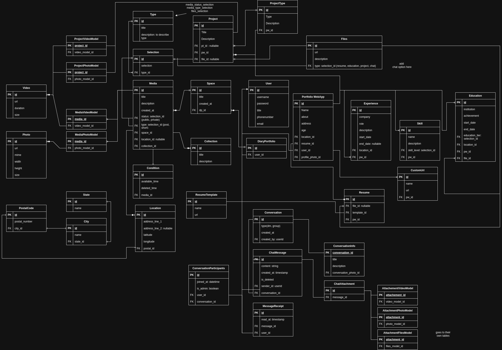

# Diary Portfolio + Portfolio Profile

This backend application is a combination of diary portfolio and also portfolio web app. 
It has features such as:

Diary Portfolio:
1. Diary post public, or with secure key
2. Diary post with private key for individuals sharing only + time based if wanted
3. Sharing profile is also encrypted when each shared + with or without condition specific people can view
4. Auto email sharing to set time of a post + with view limits

Portfolio Profile:
1. User own portfolio profile to show their experience, educations, jobs, and resume
2. Able to custom things for the board, upload images and videos
3. Custom portfolio styling
4. Template resume generator + downloadable resume

## Tech Stack

- **ASP.NET** 9.0.0
- **C#** 13.0
- **Docker** 3.8
- **MSSQL** 2018

## .NET Configuration

### Step 1: Clone the repository

```bash
git clone https://github.com/aimandesu/DiaryPortfolio.git
cd DiaryPortfolio
dotnet restore
npm i
```

### Step 2: Run the application

Create Database diary_portfolio either by DockerFile or MSSQL 2018 software

Create a sql migrations output from this project

Use your preferred method to run the .NET application, update your own appSettings.Development.Json with your own configuration

```bash
dotnet watch run
```

## Database

### Screenshots

<div
  style="
    display: grid;
    grid-template-columns: repeat(auto-fit, minmax(300px, 1fr));
    gap: 16px;
  "
>
  

[//]: # (  )

[//]: # (  )

[//]: # (  )

[//]: # (  )
</div>


### Setup Initial Reference
mkdir DiaryPortfolio

dotnet new webapi -o DiaryPortfolio.Api

dotnet new classlib -n DiaryPortfolio.Application
dotnet new classlib -n DiaryPortfolio.Domain
dotnet new classlib -n DiaryPortfolio.Infrastructure

dotnet sln add "DiaryPortfolio.Api/DiaryPortfolio.Api.csproj"
dotnet sln add "DiaryPortfolio.Application/DiaryPortfolio.Application.csproj"
dotnet sln add "DiaryPortfolio.Domain/DiaryPortfolio.Domain.csproj"
dotnet sln add "DiaryPortfolio.Infrastructure/DiaryPortfolio.Infrastructure.csproj"

### Tips
https://learn.microsoft.com/en-us/aspnet/core/security/authentication/identity-configuration?view=aspnetcore-9.0#lockout